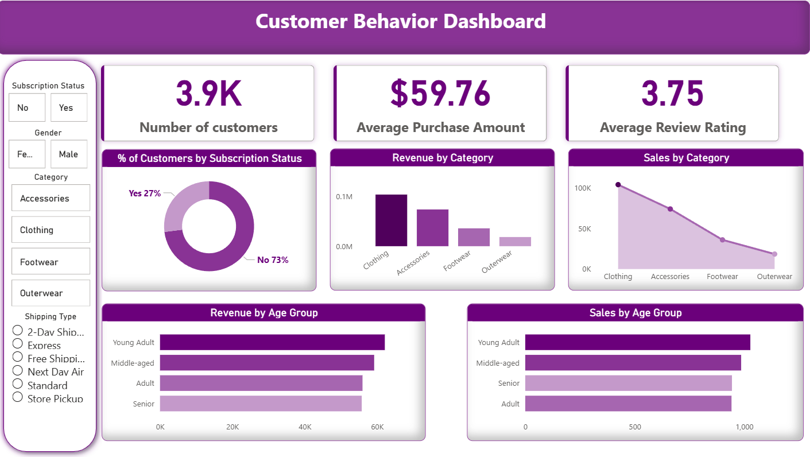

# Customer Behavior Analysis | Python, SQL, Power BI

## Project Overview
This project analyzes customer shopping behavior using Python, SQL, and Power BI to identify spending patterns, customer segments, and key business insights.

The goal is to help businesses make data-driven decisions to improve sales, customer engagement, and overall performance.

---

## Dataset Information
- Total Records: 3,900+
- Features: Customer demographics, purchase details, subscription status, shipping type, discounts, review ratings

---

## Tools and Technologies Used
- Python (Pandas, Matplotlib, Seaborn) – Data cleaning and exploratory data analysis
- SQL (MySQL) – Business analysis queries
- Power BI – Interactive dashboard creation
- GitHub – Project hosting and documentation

---

## Key Business Questions Answered
- Which customer segments generate the most revenue?
- Do subscribed customers spend more than non-subscribers?
- Which products depend most on discounts?
- Which shipping type has higher average purchase value?
- What is the revenue contribution by age group?

---

## Key Insights
- Clothing category generates the highest revenue
- Subscribed customers have higher average purchase amounts
- Young adult customers contribute the most revenue
- Loyal customers generate the majority of revenue

---

## Dashboard Preview

---

## Project Files Included
- customer_behavior_analysis.ipynb → Python analysis and data cleaning
- customer_behavior_analysis.sql → SQL business analysis queries
- customer_behavior_dashboard.pbix → Power BI dashboard
- Customer_Behavior_Analysis_Report.pdf → Detailed project report
- Customer_Behavior_Analysis_Presentation.pptx → Project presentation
- customer_shopping_behavior_raw.csv → Raw dataset
- customer_shopping_behavior_cleaned.csv → Cleaned dataset

---

## Skills Demonstrated
- Data Cleaning
- SQL Analysis
- Data Visualization
- Dashboard Development
- Business Insight Generation

---

## Author
Aryan Saraswat  
Aspiring Data Analyst
